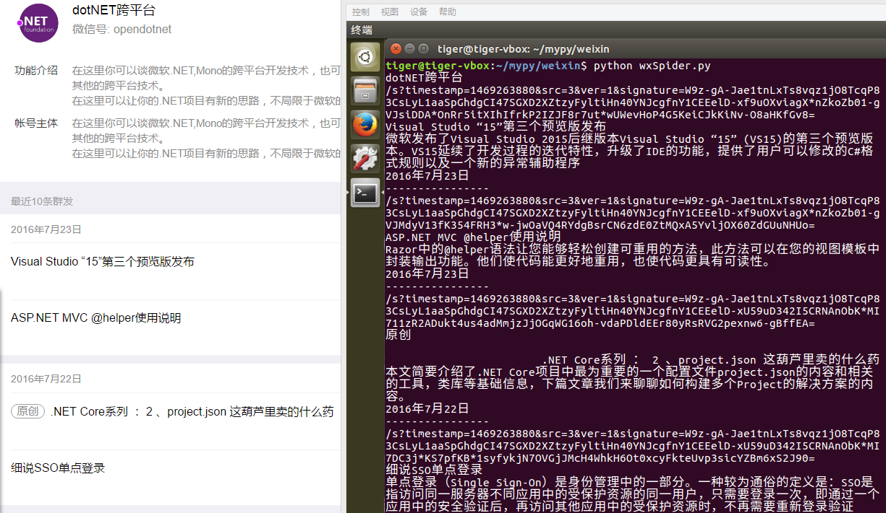

### 抓取微信公众号文章

#### 环境搭建

执行环境及依赖包：

1. Python 2.7.x
2. lxml
3. selenium
4. Phantomjs
5. 测试运行环境为 Ubuntu (win下运行请指定好phantomjs的路径)

*** 

安装依赖包：

```
$ sudo pip install selenium
$ sudo apt-get install python-dev libxml2-dev libxslt1-dev zlib1g-dev (lxml的依赖包)
$ sudo pip install lxml
PhantomJS  (从phantomjs官网下载安装包)
```

*** 

#### 项目说明

项目缘起于2015.9月份左右开始的第一个爬虫项目： `WeiXinClub` 抓取搜狗微信搜索的公众号文章信息。那时微信搜狗搜索对公众号文章的反爬虫机制还比较简单，该项目[WeiXinClub](http://weixin.itfanr.cc/) 一直在后台运行了近两个月后出现报错问题，原因为搜狗加强了公众号搜索页面的反爬虫机制：必须登陆后才能查看信息。
后又因搜狗加入了时间戳限制，获取的网页一段时间后即失效，最终无奈放弃抓取。最终通过手动的方式来收集微信文章。

今于2016.7.23在知乎搜索到相关问题的讨论，遂考虑重启该爬虫项目。 见：[如何利用爬虫爬微信公众号的内容？ - 何大米的回答 - 知乎](https://www.zhihu.com/question/31285583/answer/100263061)

*** 

#### 项目进度

* `2016-7-23` 实现抓取指定公众号最近发布的10条群发文章列表数据。目前实现了提取 `title` `link` `desc` `pubtime` 四项(仅提供思路，可自行修改)，由于搜狗反爬虫机制，获取到的文章详情链接有时效性，待解决。

*** 

#### 相关知识

* https://www.zhihu.com/question/31285583/answer/100263061
* https://github.com/Alexis374/tech_post/blob/master/crawl%20wechat%20article.md
* http://www.cnblogs.com/jane0912/p/4177779.html
* https://www.zhihu.com/question/26682162
* http://www.cnblogs.com/xieqiankun/p/xpath_extract_text.html

*** 

#### 效果



*** 